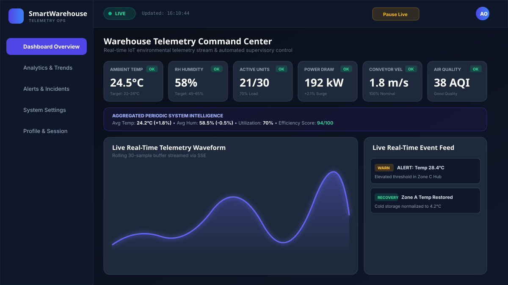
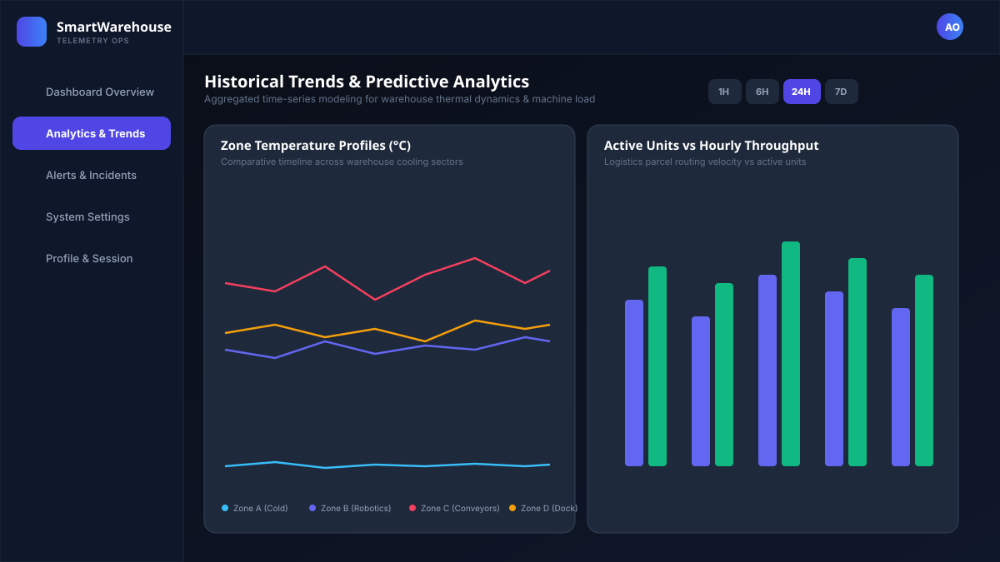
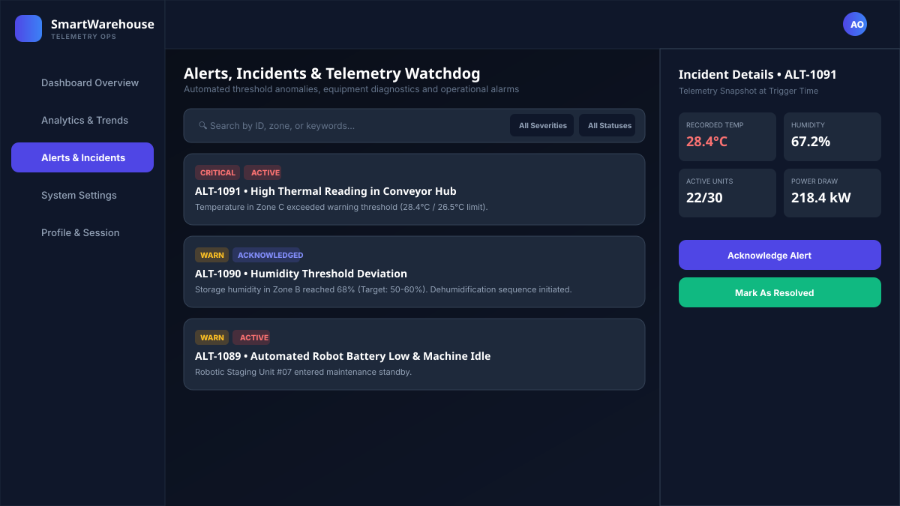

# Smart Warehouse Real-Time Monitoring Ops Cloud 🏭⚡

A full-stack, production-grade, multi-modal IoT real-time monitoring web application for industrial smart warehouses. Built with **React**, **Redux Toolkit**, **Tailwind CSS**, **Framer Motion**, **Recharts**, **Node.js/Express**, **Server-Sent Events (SSE)**, and **JWT Session Authentication**.

---

## 📸 Screenshots & Live UI Preview

Here are high-definition visual previews of the application's key screens:

### 1. Dashboard Overview & Real-Time Telemetry Stream


### 2. Analytics & Historical Trends (Recharts)


### 3. Alerts & Incident Watchdog Center with Telemetry Drawer


---

## 🌟 Key Features

### 1. ⚡ Live Real-Time Telemetry Ingestion (SSE + Redux Toolkit)
- Real-time continuous streaming via Server-Sent Events (`GET /api/stream`) updating the UI without manual page refresh.
- Fluctuating numeric metrics:
  - **Ambient Temperature** (°C)
  - **Relative Humidity** (% RH)
  - **Active Robotics & Machines** (Count / Total)
  - **Substation Electrical Power Load** (kW)
  - **Conveyor Line Velocity** (m/s)
  - **Particulate Air Quality Index** (AQI)
- Real-time **LIVE / PAUSED / RECONNECTING** glowing badge indicators.
- Live timestamp of last received telemetry packet.
- Rolling 30-sample real-time oscilloscope waveform graph.
- Interactive **Pause Live Stream / Resume Live Stream** toggle controlling global Redux ingestion.

### 2. 📊 Periodic API Polling & Aggregated Intelligence
- Periodic REST API polling (`GET /api/dashboard/summary`, `GET /api/dashboard/alerts`) executed via Redux `createAsyncThunk`.
- User-configurable polling interval (5s, 10s, 15s, 30s) in Settings.
- Logically distinct from raw stream: computes sliding-window statistical averages, min/max envelopes, machine utilization rates, facility efficiency index (0-100), and 24-hour comparative trend deltas (`+1.8%`, `-0.5%`, `+3.2%`).

### 3. 🔐 Frontend & Backend Session Management (JWT)
- Authenticated JWT login flow (`POST /api/auth/login`) with demo credentials auto-fill.
- Protected multi-page routes via `<ProtectedRoute>` redirecting unauthenticated traffic to `/login`.
- Expired/invalid session safety transitions with notification banners and storage purge.
- Interactive **Simulate Expiry** button & live JWT countdown timer on the Profile page.
- Logout endpoint (`POST /api/auth/logout`) and session metadata audit log.

### 4. 🎨 Theming & Modern SaaS UI
- Consistent dark "Cyber-Ops" and light "Enterprise Clean" modes with instant toggle and `localStorage` persistence.
- Curated color scheme:
  - **Primary**: Indigo & Electric Blue (`#4f46e5`, `#6366f1`)
  - **Success / Nominal**: Emerald Green (`#10b981`)
  - **Warning**: Amber (`#f59e0b`)
  - **Critical**: Crimson Red (`#ef4444`)
- Glassmorphism panels, micro-animations, glowing status cards, and responsive sidebar navigation.

### 5. 📑 6 Distinct Application Pages
1. **Login Portal (`/login`)**: Authentication form, demo credentials auto-fill, live backend status.
2. **Dashboard Overview (`/dashboard`)**: Live fluctuating telemetry cards, real-time Recharts oscilloscope, zone floorplan matrix, periodic summary bar, live event ticker.
3. **Analytics & Trends (`/analytics`)**: Historical trends across 4 zones, multi-range filtering (`1H`, `6H`, `24H`, `7D`), throughput bar charts, and power load area charts.
4. **Alerts & Incidents (`/alerts`)**: Searchable, filterable (Severity & Status), sortable incident database with an animated slide-out **Alert Details Drawer** and **Acknowledge / Resolve** action workflows.
5. **System Preferences (`/settings`)**: Theme switch, polling frequency selector, temperature/humidity warning & critical threshold calibration sliders, and fault injection sandbox.
6. **Profile & Session (`/profile`)**: Operator role credentials, session security audit (IP, timestamp, session ID), live JWT expiration timer, and simulated expiry test.

### 6. 🎛️ Multi-Modal Interactivity
- Interactive search, multi-field severity & status filtering, and sorting.
- Threshold sliders that dynamically adjust live OK / WARN / CRITICAL status classifications.
- Interactive Anomaly & Fault Injection sandbox: simulate **Thermal Runaways**, **Robot Starvation**, and **Humidity Surges** with one click.
- Floating animated toast notifications system.
- Slide-out inspect Drawer and telemetry snapshot Modals.

---

## 🛠️ Technology Stack

| Layer | Technologies |
|---|---|
| **Frontend Framework** | React 19, Vite, JavaScript (ES Modules) |
| **State Management** | Redux Toolkit (`configureStore`, `createSlice`, `createAsyncThunk`), React Redux |
| **Routing** | React Router v7 (`BrowserRouter`, `Routes`, `Route`, `Navigate`) |
| **Styling & Design** | Tailwind CSS v3, Vanilla CSS Design System, Google Fonts (Inter, Outfit, JetBrains Mono) |
| **Animations** | Framer Motion |
| **Visualizations** | Recharts (Area, Line, Bar, Composed charts) |
| **Icons** | Lucide React |
| **Backend Runtime** | Node.js, Express.js |
| **Streaming Protocol**| Server-Sent Events (SSE) `text/event-stream` |
| **Authentication** | JSON Web Tokens (`jsonwebtoken`), Bearer HTTP headers |

---

## 📁 Repository Structure

```text
smart-warehouse-monitoring/
├── screenshots/
│   ├── 01-dashboard-overview.svg
│   ├── 02-analytics-trends.svg
│   └── 03-alerts-incidents.svg
│
├── backend/
│   ├── src/
│   │   ├── controllers/
│   │   │   ├── alertController.js       # Alerts CRUD, Acknowledge & Resolve
│   │   │   ├── authController.js        # Login, Logout, Session Verification
│   │   │   ├── dashboardController.js   # Periodic Summary & Analytics
│   │   │   └── streamController.js      # SSE text/event-stream broadcast
│   │   ├── middleware/
│   │   │   ├── authMiddleware.js        # JWT Bearer verification
│   │   │   └── errorHandler.js          # Global error handler
│   │   ├── routes/
│   │   │   ├── alertRoutes.js           # /api/dashboard/alerts
│   │   │   ├── authRoutes.js            # /api/auth/login, logout, session
│   │   │   ├── dashboardRoutes.js       # /api/dashboard/summary, analytics, zones
│   │   │   └── streamRoutes.js          # /api/stream, /api/simulate-anomaly
│   │   ├── services/
│   │   │   ├── alertService.js          # Alerts store & filter queries
│   │   │   ├── analyticsService.js      # Rolling window averages & trend deltas
│   │   │   ├── authService.js           # User store & session tracking
│   │   │   └── telemetryGenerator.js    # Continuous fluctuating dummy engine
│   │   ├── utils/
│   │   │   ├── constants.js             # Thresholds, Statuses & Zone definitions
│   │   │   └── jwt.js                   # Token signing & decoding
│   │   └── server.js                    # Express app bootstrap & port binding
│   ├── .env                             # Port, JWT secret & stream intervals
│   └── package.json
│
├── frontend/
│   ├── src/
│   │   ├── app/
│   │   │   └── store.js                 # Redux Toolkit root store
│   │   ├── features/
│   │   │   ├── auth/
│   │   │   │   ├── authSlice.js         # loginUser, checkSession, logoutUser thunks
│   │   │   │   └── authSelectors.js
│   │   │   ├── dashboard/
│   │   │   │   ├── dashboardSlice.js    # updateLiveMetrics, fetchSummary, fetchAnalytics
│   │   │   │   └── dashboardSelectors.js
│   │   │   ├── alerts/
│   │   │   │   ├── alertsSlice.js       # fetchAlerts, acknowledgeAlert, resolveAlert
│   │   │   │   └── alertsSelectors.js
│   │   │   └── settings/
│   │   │       ├── settingsSlice.js     # theme, thresholds, refreshInterval, localStorage
│   │   │       └── settingsSelectors.js
│   │   ├── components/
│   │   │   ├── alerts/                  # AlertDetailsDrawer, AlertDetailsModal
│   │   │   ├── common/                  # Navbar, Sidebar, ProtectedRoute, LiveBadge, StatusBadge, Toast, Modal, Drawer
│   │   │   └── dashboard/               # LiveMetricCard, LiveEventFeed, WarehouseZoneGrid, SummaryStatsBar
│   │   ├── hooks/
│   │   │   ├── useSSE.js                # SSE EventSource listener & Redux dispatch
│   │   │   └── usePolling.js            # Configurable periodic fetchSummary/fetchAlerts interval
│   │   ├── layouts/
│   │   │   └── DashboardLayout.jsx      # Master layout wrapping protected routes
│   │   ├── pages/
│   │   │   ├── LoginPage.jsx            # Page 1: Auth portal
│   │   │   ├── DashboardOverviewPage.jsx# Page 2: Real-time mission control
│   │   │   ├── AnalyticsPage.jsx        # Page 3: Historical trends & Recharts
│   │   │   ├── AlertsPage.jsx           # Page 4: Incident management & drawer
│   │   │   ├── SettingsPage.jsx         # Page 5: Thresholds & preferences
│   │   │   └── ProfilePage.jsx          # Page 6: Session security & JWT countdown
│   │   ├── routes/
│   │   │   └── AppRoutes.jsx            # React Router route tree
│   │   ├── services/
│   │   │   └── api.js                   # Fetch wrapper with auto JWT & 401 interception
│   │   ├── App.jsx                      # App root with Theme sync & ToastProvider
│   │   ├── main.jsx                     # Redux Provider mount
│   │   └── index.css                    # Tailwind directives & CSS design system
│   ├── index.html
│   ├── vite.config.js                   # Port 5173 / proxy configuration
│   ├── tailwind.config.js
│   └── package.json
│
├── package.json                         # Monorepo root scripts
└── README.md
```

---

## 🚀 Quick Setup & Running Locally

### Prerequisites
- **Node.js**: v18.0.0 or higher
- **npm**: v9.0.0 or higher

### 1. Install All Dependencies
From the repository root:
```bash
npm run install:all
```
*(Or navigate into `backend` and `frontend` separately and run `npm install` in each)*

### 2. Start the Backend Server (Port 5000)
```bash
npm run start:backend
# Or: cd backend && npm run dev
```
The backend will launch at `http://localhost:5000`.

### 3. Start the Frontend Dev Server (Port 5173 / 5174)
In a second terminal:
```bash
npm run start:frontend
# Or: cd frontend && npm run dev
```
Open your browser and navigate to **`http://localhost:5174`** (or the URL printed by Vite).

---

## 🔑 Demo Credentials

| Role | Email | Password | Access Tier |
|---|---|---|---|
| **Lead Operations Engineer** | `admin@example.com` | `admin123` | Tier 3 (Full Supervisory Control) |

*(A quick **"Auto Fill"** button is provided on the login page for instantaneous 1-click access)*

---

## 📄 License
MIT License. Built for the Full-Stack Recruitment Assessment.
